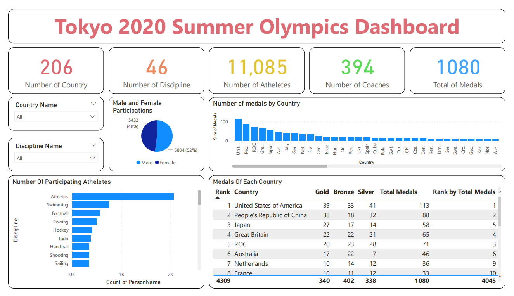
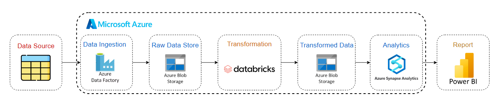
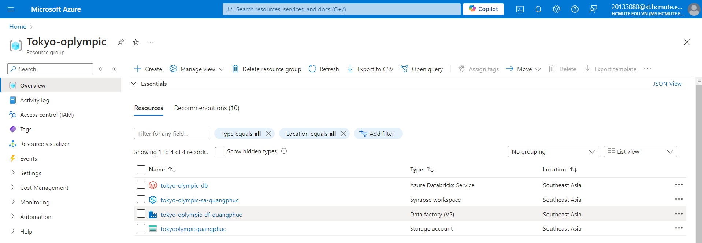
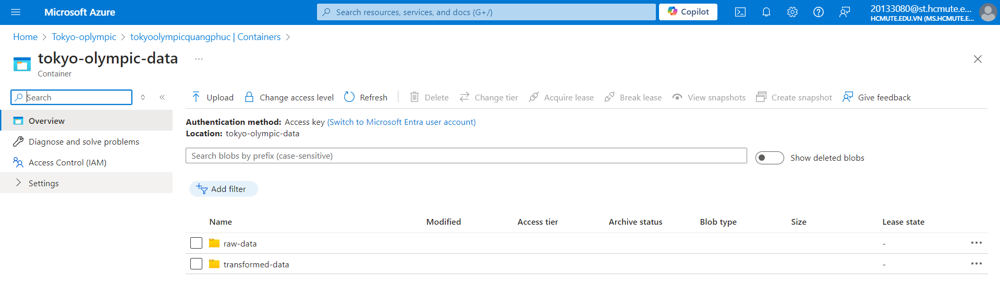
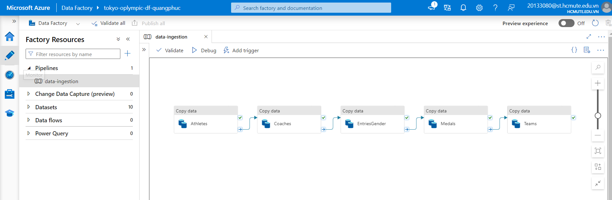
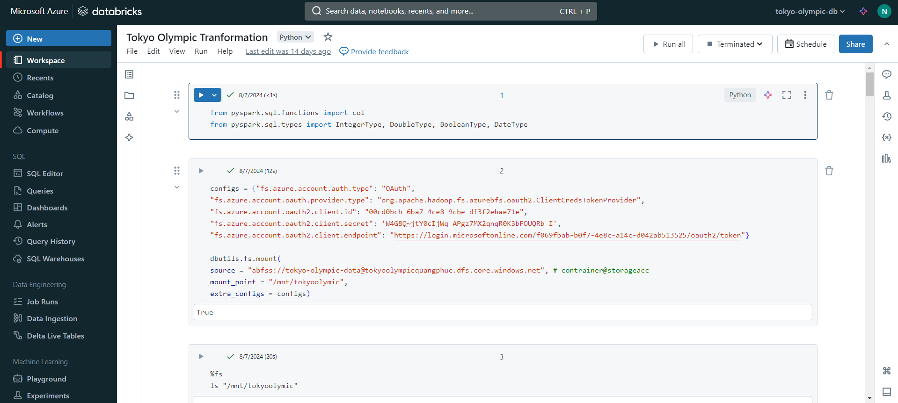
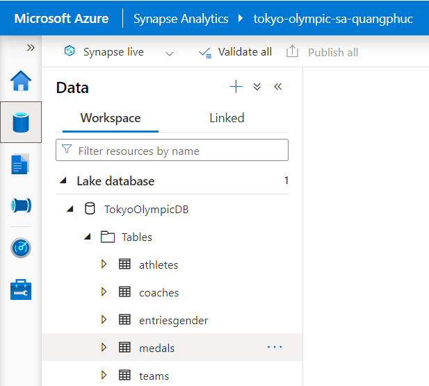

  

  

    <ul>
      
<h1 style="display: inline-block;">🥇🥈🥉Tokyo 2020 Summer Olympic Azure data engineering project</h1>

    </ul>
  

  
  
Create Azure Cloud Pipeline with Data Factory, Data Lake Storage, Databricks, Synapse Analytics, PowerBI.

 

## 📑 Table of Contents
1. [Project Overview](#introduction)
2. [Key Insights](#key-insights)
3. [Project Architecture](#project-architecture)  
  3.1. [Data Ingestion](#data-ingestion)  
  3.2. [Data Transformation](#data-transformation)  
  3.3. [Data Loading](#data-loading)  
  3.4. [Data Reporting](#data-reporting)
4. [Reference](#reference)
5. [Contact](#contact)

## 🔬 Project Overview 

This an end-to-end data engineering project on the Azure cloud:
- Data ingestion into Azure Data Lake Gen 2 using Data Factory.
- Data transformation using Databricks and Spark.
- Using Synapse Analytics to load data and store into Database.
- Reporting using PowerBI.

Using Python notebook to Tokyo 2020 Summer Olympic data analysis and data visualization.
- Access the link here: [TokyoOlympicsDataAnalysis](TokyoOlympicsDataAnalysis.ipynb)
### 🗃️ Dataset

This contains the details of over 11,000 athletes, with 47 disciplines, along with 743 Teams taking part in the 2021(2020) Tokyo Olympics. This dataset contains the details of the Athletes, Coaches, Teams participating as well as the Entries by gender. It contains their names, countries represented, discipline, gender of competitors, name of the coaches.

Will update the dataset with medals(gold, silver, bronze), more details about the athletes after few weeks.

- Athletes.xlsx : Contains details about the participating Athletes( Name (name of the athlete) , NOC (Country) , Discipline )
- Coaches.xlsx : Contains details about the Coach(Country, Discipline, Event)
- EntriesGender.xlsx : Contains details about the Coach(Country, Discipline, Event)
- Medals.xlsx : Medals as on 29th July 2021
- Teams.xlsx : Contains the details of all the Teams(Country, event, Discipline, Event)

> For this project I used the **2021 Olympics in Tokyo Data**.
<a href="https://www.kaggle.com/datasets/arjunprasadsarkhel/2021-olympics-in-tokyo" target="_blank">2021 Olympics in Tokyo Data</a>

### 🎯 Project Goals

- Ingest all raw data files into the Azure Data Lake.
- Apply data cleaning and transformation using Azure Databricks.
- Utilize Azure Synapse Analytics for loading clean data and storage into database.
- Create interactive data visualizations and reports with Microsoft Power BI.

## 💡 Key Insights

- 👨👩 **Male and Female Of Participating**
  - *Male* with 5884(52%) and *Female* with 5432(48%).

- 🏃‍♂️🏃‍♀️ **Number Of Participating Atheletes**
  - *Atheletics* is the top number 1 of Atheletes participate with 2068 followed by *Swimming* with 743 and *Football* with 567.
 
- 🗺️ **Number of medals by country**
  - **Top 1:** United States of America have the most total medals with 113.
  - **Top 2:** People's Republic of China have the most total medals with 88.
  - **Top 3:** ROC have the most total medals with 71.

- 📋 **List of medals of each product** 

## 🛠️ Project Architecture

You can find the detailed information on the diagram below:

### 📤 Data Ingestion

- Setup the **Resource group** with needed services (Storage Account, Data Factory, Databricks, Synapse Analytics)

- Using Azure Data Lake Storage Gen2 create 2 folder raw-data and transformed-data to contain data.

- Data Pineline using Azure Data Factory to loading data into Data Lake Gen 2, transfomed data and save cleared data.

### ⚙️ Data Transformation
- Retrieve raw data from the Data Lake.
- Used Spark Cluster in Azure Databricks to clean and refine the raw data.
- Saved the cleaned data in a csv format; optimized for further analysis.

### 📥 Data Loading
- Used Azure Synapse Analytics to load the refined data efficiently.
- Created SQL database and connected it to the data lake.

### 📊 Data Reporting
- Connected Microsoft Power BI to Azure Synapse, and used the Views of the DB to create interactive and insightful data visualizations.

### 🛠️ Technologies Used

- **Data Source**: Kaggle website
- **Orchestration**: Azure Data Factory
- **Ingestion**: Azure Data Lake Gen2
- **Storage**: Azure Synapse Analytics
- **Data Visualization**: PowerBI

## 📋 Reference

- This Project is inspired by the video of the [YouTube Channel "Mr. K Talks Tech"](https://www.youtube.com/watch?v=IaA9YNlg5hM)  

## 📨 Contact Me

- Name: Nguyễn Quang Phúc
- Gmail: nguyenquangphuc412@gmail.com